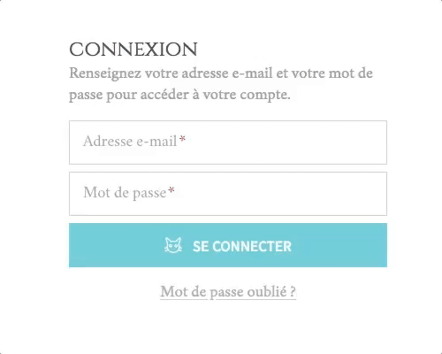

# Challenge Login

Des formulaires, d'accord, mais des formulaires React :muscle:

## Instructions

L'objectif est de créer un formulaire permettant une expérience utilisateur
conciliant design et utilisabilité. Une image vaut mieux que 1000 mots :

## Charte

Cette fois-ci, on essaie de faire une interface assez joli, alors on sort ce qu'il faut : polices, couleurs, détails.  
Pour ne pas perdre trop de temps sur le challenge, le fichier `app.styl` est déjà préparé :kissing_heart:

Quant aux input, n'hésitez pas à reprendre notre composant `<Field />` d'aujourd'hui !

### Google Fonts

* Titres : Cinzel
* Textes : Crimson Text
* Boutons : Source Sans Pro

### Couleurs

* Titres : #51483f
* Textes : #999
* Input
  + Placeholder : #999
  + Valeur : #51483f
  + Bordure : #ccc
  + Bordure focus : #67c8d4
  + Label : #51483f
  + Label focus : #82d2dc
  + Error : #e31e2a
* Bouton : #67c8d4 + #fff
* Lien : #aaa8a6

Egalement présent dans le fichier `app/styles/charte.styl`.

### Images

Dans le dossier `app/assets/images`.
